

  

  

I build AI and automation systems that people use every day, and I co-founded **[MelberLabs](https://melberlabs.com)**, an independent product studio from Türkiye. I have built 7 mobile apps there as the sole developer, plus the AI content engine that runs their social media. I hold a B.Sc. in Software Engineering from **Işık University**. I captained the **Işık Chargers** American football team for three seasons, now coach its linebackers, and built the team's platform.

Source code lives in private repositories. The cards link to the products or to case-study repos that explain how each one is built.

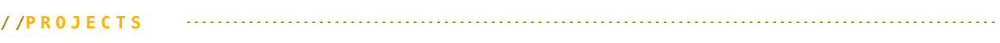

  <a href="https://ocupyapp.melberlabs.com"></a>
  <a href="https://manastra.melberlabs.com"></a>
  <a href="https://github.com/meliksahkose/kelvia-app"></a>
  <a href="https://melberlabs.com"></a>
  <a href="https://melberlabs.com"></a>
  <a href="https://github.com/meliksahkose/astrio-app"></a>
  <a href="https://github.com/meliksahkose/teneffus-app"></a>
  <a href="https://chargers.melberlabs.com"></a>
  <a href="https://github.com/meliksahkose/melberlabs-content-engine"></a>

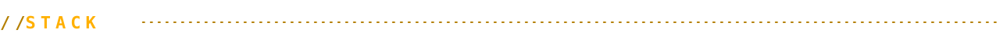

  

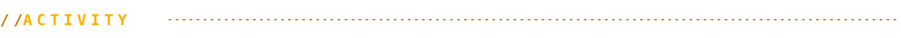

  <picture>
    <source media="(prefers-color-scheme: dark)" srcset="https://raw.githubusercontent.com/meliksahkose/meliksahkose/output/snake-dark.svg" />
    
  </picture>

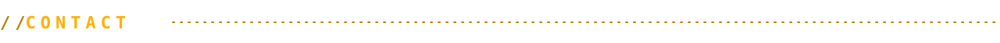

  <a href="https://melberlabs.com"><b>melberlabs.com</b></a>
  &nbsp;·&nbsp;
  <a href="https://www.linkedin.com/company/melberlabs">LinkedIn</a>
  &nbsp;·&nbsp;
  <a href="mailto:melberlabs@gmail.com">melberlabs@gmail.com</a>

<!-- Görseller tools/build.mjs ile üretilir: node tools/build.mjs -->
