  

  

I co-founded **[MelberLabs](https://melberlabs.com)**, an independent product studio from Türkiye. Two founders, a handful of focused mobile apps, shipped every week. I'm a 4th-year Software Engineering student at **Işık University**. I also play linebacker **#45** for the **Işık Chargers** and built the team's platform.

Most of my work lives in private repositories, so the cards below link to the products themselves.

  
  
  
  
  
  
  
  

Earlier: <a href="https://github.com/meliksahkose/YapayZekaDestekliKutuphane">YapayZekaDestekliKutuphane</a>, a personal library manager with an AI chat assistant (Java Swing).

  

  <picture>
    <source media="(prefers-color-scheme: dark)" srcset="https://raw.githubusercontent.com/meliksahkose/meliksahkose/output/snake-dark.svg" />
    
  </picture>

  <a href="https://melberlabs.com"><b>melberlabs.com</b></a>
  &nbsp;·&nbsp;
  <a href="https://www.linkedin.com/company/melberlabs">LinkedIn</a>
  &nbsp;·&nbsp;
  <a href="mailto:melberlabs@gmail.com">melberlabs@gmail.com</a>

<!-- Görseller tools/build.mjs ile üretilir: node tools/build.mjs -->
